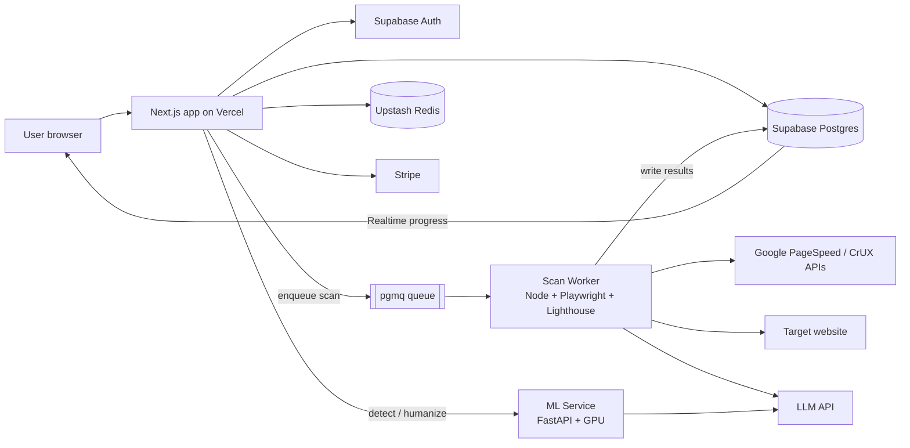

# 01 — Architecture

## Tech stack

| Layer | Choice | Why |
|-------|--------|-----|
| Frontend + web API | **Next.js 15 (App Router) + TypeScript** | SSR for SEO landing pages, API routes, one codebase |
| UI | **Tailwind CSS + shadcn/ui + Recharts** | Fast to build, good charts for reports |
| Auth, DB, storage | **Supabase** (Postgres, Auth, Storage, Realtime) | Already connected; RLS for per-user data; Realtime for live job progress |
| Job queue | **Supabase `pgmq`** (Postgres message queue) | No extra infra; workers pull jobs |
| Website scan worker | **Node.js + Playwright + Lighthouse** on Railway / Fly.io / Render | Needs a real headless Chrome and long runtimes (Vercel/Edge can't do this well) |
| ML service (detector) | **Python + FastAPI + PyTorch/Transformers** on a GPU host (Modal / RunPod / HF Inference Endpoints) | Runs our detector model + perplexity model |
| LLM (humanizer, summaries) | **OpenAI / Anthropic API**, optionally a self-hosted fine-tuned open model (Llama / Mistral / Qwen) later | High-quality rewriting; fine-tuned model lowers cost and improves "human" style |
| Rate limiting & cache | **Upstash Redis** | Per-IP / per-user limits, cache scan results |
| Payments | **Stripe** | Subscriptions + credit packs |
| Email | **Resend** | Auth emails, "your report is ready" |
| Hosting (web) | **Vercel** | Native Next.js hosting |
| Monitoring | **Sentry** (errors) + **PostHog** (product analytics) | |

## High-level diagram



## Request flows

### Website scan
1. User submits URL → `POST /api/scans`.
2. API validates URL (format + SSRF checks, see doc 11), checks quota, checks Redis cache (same URL scanned in the last 1h → return cached).
3. Inserts `scans` row with `status = queued`, pushes job to `pgmq`.
4. Worker picks job, runs checks in parallel (Lighthouse, crawler, headers, SSL, DNS, PSI/CrUX), updating `scans.progress` as it goes.
5. Worker computes scores, generates recommendations, calls LLM for the summary, saves `scan_results`, sets `status = completed`.
6. Frontend listens via Supabase Realtime on the `scans` row and renders the report when done.

### AI detection
1. `POST /api/detect` with text → quota check → forward to ML service `/detect`.
2. ML service returns overall score + per-sentence scores + signals (typically < 3s).
3. Saved to `text_checks`, returned to the client.

### Humanize
1. `POST /api/humanize` → quota check (word-based) → ML service `/humanize`.
2. ML service runs the rewrite pipeline (doc 03): rewrite → post-process → self-detect → meaning check → retry if needed.
3. Streams the final text back (Server-Sent Events) so the user sees progress.

## Repository layout (monorepo)

```
lucenta/
├─ apps/
│  ├─ web/             # Next.js app (UI + API routes)
│  ├─ scan-worker/     # Node worker: Playwright, Lighthouse, crawlers
│  └─ ml-service/      # Python FastAPI: detector + humanizer pipeline
├─ packages/
│  ├─ shared/          # Shared TS types, zod schemas, scoring constants
│  └─ ui/              # Shared React components (optional)
├─ supabase/
│  ├─ migrations/      # SQL migrations
│  └─ seed.sql
├─ benchmarks/         # Detector benchmark harness + datasets (doc 10)
├─ docs/               # These documents
└─ package.json        # pnpm workspaces + Turborepo
```

## Environments
- **local** — Supabase CLI local stack, worker and ML service run locally (ML on CPU with a small model).
- **staging** — Supabase branch, preview deploys on Vercel.
- **production** — main Supabase project.
